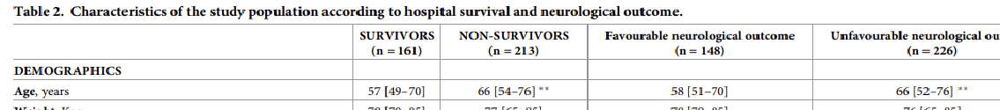

--- 
title:  "Exercise 1: Lactate levels after Cardiac Arrest"
---

 
 

This exercise is based on the paper  

Iesu, E., Franchi, F., Zama Cavicchi, F., Pozzebon, S., Fontana, V., Mendoza, M., ... & Taccone, F. S. (2018).  
**Acute liver dysfunction after cardiac arrest.**  
PLoS One, 13(11), e0206655..   

The paper can be found at https://journals.plos.org/plosone/article?id=10.1371/journal.pone.0206655 and the authors have made their data available by placing an Excel file in the dryad repository at  https://datadryad.org/stash/dataset/doi:10.5061/dryad.qv6fp83.  

 
 

Complete the following tasks, making sure that your R script is legible by including comments, choosing descriptive names and paying attention to the layout.

 

(a) Follow the check-list in the `introduction` to set up your own project. Download the data from Dryad and save it in the `rawData` folder.  

 

(b) Adapt code from the demonstration script `demo1` so as to read the downloaded data, clean it  and save the data in rds format within your own folder structure. Save your code in a file called `solution1.R`.

 

(c) The image below is taken from Table 2 of the paper. It shows the summary statistics for age by in-hospital mortality (`hospDeath`) and by favourable neurological outcome (`favOutcome3MonthCpc1_2_1`) 3 months after admission, which the authors define as not death, a vegetative state or severe neurological impairment. The figures show the median with quartiles in square brackets and the stars indicate a Wilcoxon rank sum test with a p-value below 0.01.   

 

 

Add code to solution1.R that confirms all of the statistics in this table.  

 

(d) As well as death in hospital (`hospDeath`), the study data include a column that identifies whether or not the patient died in ICU (`icuDeath`). So, there are three possibilities for each patient, namely, (i) they survive to discharge, (ii) they survive ICU but die in hospital, (iii) they die in ICU.  

 

Add code to `solution1.R` that creates a new variable called `outcome` that takes the values 0, 1, 2 to denote the three cases (i to iii). 

 

Plot histograms of the length of stay in ICU faceted by `outcome`.  

 

For each level of `outcome` find the median and quartiles of the length of stay in ICU.  

 

Perform a non-parametric comparison of the length of stay in ICU across the three levels of `outcome` using the Kruskal-Wallis test. 

 

(e) Lactate (lactic acid minus one proton) is a by-product of glucose metabolism and can build up in muscles during extreme exercise causing cramp. Lactate is still created under less extreme conditions, but a healthy person will clear it via the liver and kidneys. The system for clearing lactate can fail when someone is extremely ill and consequently lactate levels in the blood will rise. For this reason, lactate is measured in ICUs as a general indicator of severity of illness. The study data contain a variable `lactIcuAdm` that gives the lactate measured at the time of admission to the ICU.  

 

Calculate summary statistics, plot graphs and perform statistical tests to investigate whether or not lactate as measured in the blood sample taken at admission relates to the three levels of the `outcome` variable.   

 

Make a scatter plot of length of stay in ICU (y-axis) against lactate (x-axis). Add a smoother to the plot, either linear or lowess, as you feel is appropriate.  

 

Repeat the scatter plot but with both the x and y axes showing a log scale.  

 

Use facets to produce three scatter plots that show stay in ICU by lactate for each of the levels of `outcome`.  

 

(f) Use Rmarkdown to create a report based on your analysis that describes the relationship between outcome, lactate and length of stay in ICU.

