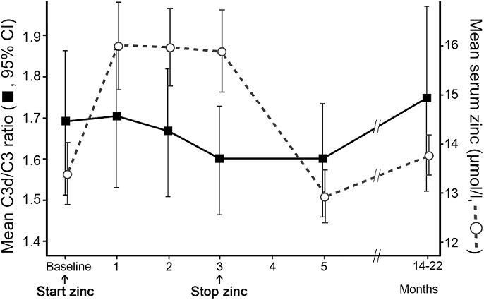

--- 
title: 'Solution 2: C3 activation in ARMD'
editor_options:
  chunk_output_type: console
output: html_document
---

<br>
<br>

** (b) Adapt code from the demonstration script `demo2` so as to read the downloaded data, clean it  and save the data in rds format within your own folder structure. Instead of the zinc measurements, include the C3d/C3 ratios. Save your code in a file called `solution2.R`. **

The only changes that you will need to make are to the header and to the file paths

```{r message=FALSE, warning=FALSE}
# ================================================================== 
# File:        solution2.R
# Project:     Zinc (project folder C:/Projects/ISCB)
# Author:      john thompson
# Date:        22 July 2022
# Description: C3 activation over time  
# ================================================================== 
library(tidyverse)
library(readxl)
library(janitor)

excel_file <- "C:/Projects/Rcourse/ISCB/data/rawData/smailhodzic/Zinc supplementation inhibits complement activation in age-related macular degeneration.xls"
rds_file   <- "C:/Projects/Rcourse/ISCB/data/rData/c3ratio.rds"

#-----------------------------------------------------------------
# Read & clean the data
#
read_excel( excel_file ) %>%
  clean_names("lower_camel") %>%
  # keep the SNPs and all the C3 values
  select( studyNo, cfhY402H, arms2Rs10490924, starts_with("c3")) %>%
  # convert the SNPs to factors
  mutate( cfh  = factor(cfhY402H, 
                        levels=1:3, 
                        labels=c("TT", "CT", "CC")),
          arms = factor(arms2Rs10490924, 
                        levels=1:3, 
                        labels=c("GG", "TG", "TT"))) %>%
  # drop the original SNP variables
  select( -cfhY402H, -arms2Rs10490924) %>%
  # convert wide C3 values to the long format
  pivot_longer( c3DC3RatioV1:c3DC3RatioV6, 
                names_to="visit", 
                values_to="C3Ratio") %>%
  # edit the visit variable
  mutate( visit = str_replace(visit, "c3DC3RatioV", "")) %>%
  # convert visit to a factor
  mutate( visit = factor(visit, levels=c("1", "2", "3", "4", "5", "6"),
                         labels = c("Baseline", "1 Month", "2 Months",
                                    "3 Months", "5 Months", "18 Months") ) ) %>% 
  # save in rds format
  write_rds( rds_file)

#-----------------------------------------------------------------
# Read the clean data
#
c3DF <- read_rds( rds_file )
```

**(c) Ratios often have a distribution that is skewed to the right because small values of the denominator can create very large ratios. When this happens, it is often better to analyse the log of the ratio.**

**Plot histograms of the distribution of C3d/C3 values faceted by visit and compare it with histograms of the log10(C3d/C3) values. Which scale is better?***

```{r}
c3DF %>%
  filter( !is.na(C3Ratio)) %>%
  ggplot( aes(x=C3Ratio)) +
  geom_histogram( bins=20, fill="steelblue") +
  facet_wrap( ~ visit ) +
  labs( x     = "C3d/C3 ratio",
        title = "C3 Activation Ratio at each visit") + 
  theme_light()
```

```{r}
c3DF %>%
  filter( !is.na(C3Ratio)) %>%
  ggplot( aes(x=C3Ratio)) +
  geom_histogram( bins=20, fill="steelblue") +
  scale_x_log10() + 
  facet_wrap( ~ visit ) +
  labs( x     = "C3d/C3 ratio (log scale)",
        title = "C3 Activation Ratio at each visit") +
  theme_light()
```

The skewness is slight and it is probably unnecessary to use a log scale for these data.  

**(d) The plot below is taken from the original paper**

<style> .indented { padding-left: 30pt;  } </style>

<div class="indented">



**The zinc component of this plot was drawn in the demonstration. Use ggplot2 to make your own version of the C3d/C3 component of this plot. With the mean shown as squares, 95% CI error bars and a line connecting the means.**  

In ggplot2 a line has to be plotted on two numeric axes, whereas the x-axis here is a visit which is a factor. Internally factors are stored as 1, 2, etc so we can obtain the numeric equivalent of the factor using `as.numeric()`. Once we have the numeric version of the factor we can use it to plot the line.

I have chosen to show the treatment pattern using two colours.
```{r}
c3DF %>%
  filter( !is.na(C3Ratio)) %>%
  mutate( visit = factor(visit,
                         labels = c("Base", "1mth", "2mth", 
                                    "3mth", "5mth", "18mth"))) %>%
  mutate( treatment = fct_recode( visit,
                                  off = "Base",
                                  on = "1mth",
                                  on = "2mth",
                                  on = "3mth",
                                  off = "5mth",
                                  off = "18mth",
                                  )) %>%
  group_by(visit, treatment) %>%
  summarise( n = n(),
             C3RatioMN = mean(C3Ratio),
             C3RatioSD = sd(C3Ratio)) %>%
  mutate( lb = C3RatioMN - 1.96*C3RatioSD/sqrt(n),
          ub = C3RatioMN + 1.96*C3RatioSD/sqrt(n)) %>%
  mutate( v = as.numeric(visit)) %>%
  ggplot( aes(x = visit, y = C3RatioMN, colour = treatment)) +
  geom_point( shape = "square", size=3) +
  geom_errorbar( aes(ymin = lb, ymax = ub), width = 0.1) +
  geom_line( aes(x = v, y=C3RatioMN), colour = "black") +
  scale_colour_manual( values = c("blue", "red")) +
  labs( y        = "Mean C3d/C3 Ratio",
        title    = "C3 activation over time",
        subtitle = "activation declines during treatment"
        ) +
  theme_light() +
  theme( legend.position = c(0.2, 0.9) )
```

**(e) Test whether there is evidence of a drop in the C3d/C3 ratio between the 3 month visit and the baseline. Is the change consistent with the 10% drop anticipated by the authors when they powered the study?**

```{r}
c3DF %>%
  filter( visit %in% c("Baseline", "3 Months")) %>%
  mutate( visit = fct_drop(visit)) %>%
  pivot_wider( names_from  = visit,
               values_from = C3Ratio) %>%
  mutate( change = `3 Months` - Baseline ) %>%
  ggplot( aes( x=change)) + 
  geom_histogram( bins=20, fill="steelblue") +
  geom_vline( xintercept = 0 ) +
  labs( x = "Change in C3 activation",
        title = "Change in C3 activation between baseline and 3 months",
        subtitle = "slightly more levels drop than rise")

c3DF %>%
  filter( visit %in% c("Baseline", "3 Months")) %>%
  mutate( visit = fct_drop(visit)) %>%
  pivot_wider( names_from  = visit,
               values_from = C3Ratio) %>%
  mutate( change = `3 Months` - Baseline ) %>%
  { t.test( .$Baseline, .$`3 Months`, paired=TRUE) }

c3DF %>%
  filter( visit %in% c("Baseline", "3 Months")) %>%
  mutate( visit = fct_drop(visit)) %>%
  pivot_wider( names_from  = visit,
               values_from = C3Ratio) %>%
  mutate( change    = `3 Months` - Baseline,
          pctChange = 100 * change / `3 Months`) %>%
  summarise( m    = mean(change, na.rm=TRUE),
             mPct = mean(pctChange, na.rm=TRUE))
```

**(f) Investigate whether the change in C3d/C3 ratio between the 3 month visit and baseline is related to any of, the CFH or ARMS genotypes.**

```{r}
c3DF %>%
  filter( visit %in% c("Baseline", "3 Months")) %>%
  mutate( visit = fct_drop(visit)) %>%
  pivot_wider( names_from  = visit,
               values_from = C3Ratio) %>%
  mutate( change = `3 Months` - Baseline ) %>%
  mutate( cfh = fct_collapse(cfh, CT = c("CT", "TT"))) %>%
  filter( !is.na(cfh)) %>%
  ggplot( aes(x=change)) +
  geom_histogram( bins=20, fill="steelblue") +
  facet_grid( cfh ~ .)
  
c3DF %>%
  filter( visit %in% c("Baseline", "3 Months")) %>%
  mutate( visit = fct_drop(visit)) %>%
  pivot_wider( names_from  = visit,
               values_from = C3Ratio) %>%
  mutate( change = `3 Months` - Baseline ) %>%
  mutate( cfh = fct_collapse(cfh, CT = c("CT", "TT"))) %>%
  filter( !is.na(cfh)) %>%
  t.test( change ~ cfh, data = .)  
```

```{r}
c3DF %>%
  filter( visit %in% c("Baseline", "3 Months")) %>%
  mutate( visit = fct_drop(visit)) %>%
  pivot_wider( names_from  = visit,
               values_from = C3Ratio) %>%
  mutate( change = `3 Months` - Baseline ) %>%
  filter( !is.na(arms)) %>%
  ggplot( aes(x=change)) +
  geom_histogram( bins=20, fill="steelblue") +
  facet_grid( arms ~ .)
  
c3DF %>%
  filter( visit %in% c("Baseline", "3 Months")) %>%
  mutate( visit = fct_drop(visit)) %>%
  pivot_wider( names_from  = visit,
               values_from = C3Ratio) %>%
  mutate( change = `3 Months` - Baseline ) %>%
  filter( !is.na(arms)) %>%
  oneway.test( change ~ arms, data = .)  
```


